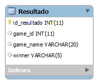
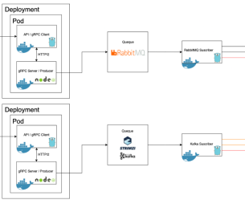
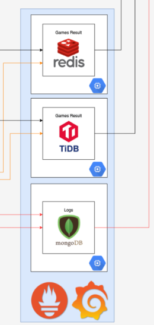
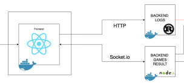

# Manual Técnico
---
## Arquitectura Implementada
---

 
  

---

## Bases de datos
---
>> tidb: 
 
  

>>Mongodb:
 
  

---

## Preguntas de Reflexión:
>> Cómo funcionan las métricas de oro, cómo puedes
interpretar las 5 pruebas de faulty traffic, usando como base los gráficos y métricas que muestra el tablero de Linkerd Grafana.

1. Estado Latente: El tiempo que lleva atender una solicitud: exitosa o fallida. Es importante rastrear no solo las solicitudes exitosas sino también las fallidas.

2. Tráfico: Una medida de cuánta demanda se está aplicando a su sistema. Para un servicio web, generalmente son solicitudes HTTP por segundo.

3. Errores: La tasa de solicitudes que fallan.

4. Saturación: Qué tan completo es su servicio. El aumento de la latencia es a menudo un indicador importante de saturación. 

- Pod Kill con Chaos Mesh: 
- Pod Failure con Chaos Mesh:
- Container Kill con Chaos Mesh:
- Network Emulation (Netem) Chaos con Chaos Mesh:
- DNS Chaos con Chaos Mesh:  

>>¿Qué sistema de mensajería es más rápido?: 

Tras extensas pruebas de envio de datos masivos mediante locust, se llego a la conclusión que kafka es el mas eficiente enviando datos, pues permite procesar un mayor volumen de mensajes consumiendo menos recursos.

>>¿Cuáles son las ventajas y desventajas de cada sistema?: 
- Ventajas de kafka:
    - Tiene una buena escalabilidad
    - Tolerancia a los fallos
    - Capacidad para procesar en tiempo real
    - Enfocado a proyectos de Big Data

- Desventajas de kafka:
    - Dependencia con apache zookeeper
    - Enrrutamiento de mensajes
    - Carece de componentes de monitorizacion

- Ventajas de RabbitMQ:
    - Adecuado para muchos protocolos de mensajería
    - Interfaz moderna e intuitiva
    - Flexibilidad y plugins disponibles
    - Herramientas de desarrollo

- Desventajas de RabbitMQ:
    - No es transaccional por defecto

>>¿Cuál es el mejor sistema?:

Depende de los recursos del equipo a utiliza y de la necesidad del usuario, ya que si se mandan datos por millones es mas eficiente kafka aunque no tiene un sistema de monitoreo.

>>¿Cuál de las dos bases de datos (Redis y TIDB) se
desempeña mejor y por qué?:

tidb se desempeña mejor ya que es sencillo de implementar y utilizar ya que tiene sintaxis SQL.

# Descripcion de Herramientas:

## Servidores de gRPC y Colas

 
  

La aplicacion cuenta con un servidor de gRPC implementado en Go  y otro implementado en Node. Cada uno implementado en distinta maquina virtual. 
* El gRPC Server de Node al recibir una peticicion HTTP2 del cliente de Go, actua como producer para la queue de RabbitMQ, que a su vez tiene su subscriber en esta misma maquina virtual para insertar en las bases de datos. 
* El gRPC Server de Go al recibir una peticion HTTP2 del cliente de Node, actua como producer para la queue de Kafka, que a su vez tiene su subscriber en esta misma maquina virtual para insertar en las bases de datos.

## Bases de Datos

 
  

La informacion generada, que viene desde locust, pasa por los clientes y servidores de gRPC y colas de queue o Kafka, es almacenada en 3 distintas bases de datos: mongoDB, tiDB y redis.

## Frontend 

 
  

El cliente final tiene acceso a una interfaz realizada en ReactJS que actua como frontend mostrando toda la informacion guardada en las bases de datos, esto gracias a que se comunica con dos backend. Uno hecho en NodeJS que trae los resultados de los juegos (almacenadas en redis y tiDB) y otro hecho en Rust que trae los logs sobre toda la informacion generada y guardada. (almacenados en mongodb)

